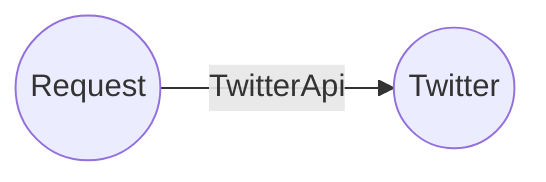
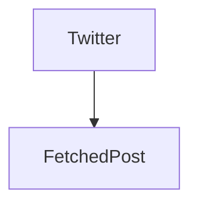

Utilizes the Twitter API to fetch twitter posts, likes and lists. 

```mermaid
graph LR
Request((Request))
Request --TwitterApi--> Twitter
Twitter((Twitter))
```

```mermaid
graph TD;

Twitter-->FetchedPost;
```
